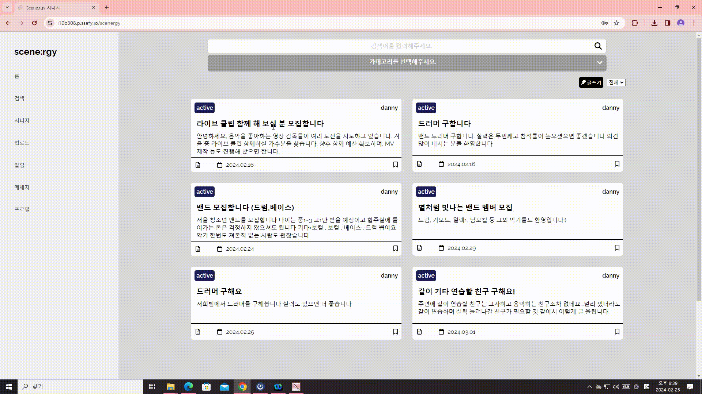

> 음악과 사람을 잇는 모든 연결의 시작, 시너지
---
### 프로젝트 진행기간
2024.01.08 ~ 2024.02.16

--- 
### 기획 배경

친구, 커뮤니티 게시글로부터 뮤지션들이 팀 활동을 하기 위해 협업파트너를 구하기 어렵다는 이야기를 전해 들었습니다. 저희는 정확히 어떠한 어려움이 있는지 알기 위해 뮤지션들을 대상으로 설문조사를 진행 하였으며, 파트너를 찾는 과정에서 어려움을 겪는 답변으로 ‘협업 파트너를 찾기 어렵다(43.9%)’, ‘실력 검증이 어렵다(43.9%)’의 비율(복수 응답 가능)이 높았습니다. 또한 원하는 기능으로 ‘음악 창작물을 공유(48.8%)’, ‘나의 활동 이력을 관리(53.7%)’의 답변 비율(복수 응답 가능)이 높았습니다.

위와 같은 뮤지션들의 어려움을 해결하기 위해 저희는 자신의 연주 영상을 기록하며 공유하고, 프로필에서 이력서를 관리할 수 있는 기능을 제공하는 ‘Scenergy’ 웹 서비스를 기획하게 되었습니다. Scenergy에서 다른 사람들의 연주 영상을 손쉽게 접하며, 마음에 드는 영상의 연주자의 포트폴리오를 확인해 검증된 협업 파트너를 보다 쉽게 구할 수 있습니다.

___
### 프로젝트 소개
+ Scenergy는 `Springboot` `React`를 기반으로 만들어진 뮤지션을 위한 웹 큐레이팅 SNS 입니다.
--- 
### 프로젝트 목표
+ 멤버를 구하는데 어려움을 겪는 뮤지션을 위해 플랫폼을 제공합니다.
+ 연주 영상 업로드에 특화된 게시글 작성 기능을 통해 자신을 어필하고 싶은 뮤지션에게 좀 더 나은 환경을 제공합니다.
+ 역할을 분담하여 서비스를 코드로  **구현**하고  **배포**합니다.
  -   구현하는 과정에서 Front-end와 Back-end가  **협업**하는 과정을 이해합니다.
  -   RESTful API를 직접 설계하고 API를 통한 HTTP 통신을 겪으며 협업 능력을 기릅니다.
  -   자신이 맡은 부분을 남에게 설명할 수 있는 의사소통 능력을 기릅니다.
  -   단순히 구현 후 끝나는 것이 아닌  **코드 리뷰**와  **피드백**을 통해 함께 성장합니다.
--- 
### 기술스택
#### 개발 환경

    

#### 개발
    

#### 커뮤니케이션
 
---
### 기능정의서 및 ERD

#### 기능정의서
##### 🔗[기능정의서](https://docs.google.com/spreadsheets/d/1eb2wqtTxqo4EBiJq_kRAA-wO56QQbC8ycn4FkqmRq-s/edit#gid=2139742202)
#### ERD

---
### 페르소나
#### 1️⃣ 드러머 구하는 김민석


#### 2️⃣ 버스킹 팀을 구하는 김미솔


#### 3️⃣ 아티스트를 꿈꾸는 장성하
{: width="600"}

### 시스템 아키텍처


---
### 백엔드 디렉토리 구조
 ```sh
domain
  ├─ entityName
  │ ├─ controller
  │ │     ├─ request
  │ │     └─response
  │ ├─ entity
  │ ├─ repository
  │ └─ service
  │      └─ command
  │ 
  ├─ test
  │  ├─domain
  │  └─ serviceTest
  └─ ScenergySpringApplication.java
```

### 프론트 디렉토리 구조
```sh
├─actions
├─apis
│  ├─entity
│  ├─Profile
│  ├─User
│  └─VideoUpload
├─assets
│  └─VideoUpload
├─components
│  ├─Chat
│  ├─commons
│  │  ├─Dialog
│  │  ├─Drawer
│  │  ├─Navbar
│  │  ├─ScenergyList
│  │  └─Search
│  ├─JobPost
│  ├─Portfolio
│  ├─Profile
│  ├─Search
│  ├─User
│  └─VideoUpload
├─contexts
├─hooks
├─pages
├─reducers
├─router
└─store
```

---
## 주요 기능 및 화면
**로그인 & 로그아웃 (네이버 OAuth)**
- 중앙의 로그인 버튼을 누른 후 소셜 로그인을 진행할 수 있습니다
- 로그인 한 사용자는 시너지 서비스를 이용할 수 있습니다.


**영상 업로드**
- 자신의 연주 영상을 업로드 할 수 있습니다.
- 팔로우 한 유저의 영상을 조회할 수 있습니다.
  
  

**채팅**
- 원하는 뮤지션과 채팅을 통해 빠른 연락이 가능합니다.
  

**화상 회의**
- 화상회의를 통해 빠른 실력검증 및 합주가 가능합니다.
  

**검색**
- 지역, 장르, 악기태그로 영상을 검색 할 수 있습니다.
- 검색어 입력을 통해 원하는 영상을 검색 할 수 있습니다.
  

**알림**
- 팔로우와 채팅 알림을 받을 수 있습니다.
  

**프로필 조회**
- 자신의 프로필을 조회하고, 정보를 갱신할 수 있습니다.
- 프로필에서 자신의 대표영상과 영상 목록을 조회할 수 있습니다.
  

**구인 구직**
- 원하는 구인정보를 확인할 수 있습니다.  
  

---
### 코드 컨벤션

#### BE 코드 컨벤션

##### 파일 공통 요건
1. 파일 인코딩은 UTF-8
2. 새줄 문자는 LF
3. 파일의 마지막에는 새줄

##### 이름 (Naming)
1. 식별자에는 영문/숫자/언더스코어만 허용
2. 한국어 발음대로의 표기 금지
3. 대문자로 표기할 약어 명시
4. 패키지 이름은 소문자로 구성
5. 클래스/인터페이스 이름에 대문자 카멜표기법 적용
6. 클래스 이름에 명사 사용
7. 인터페이스 이름에 명사/형용사 사용
8. 테스트 클래스는 'Test’로 끝남
9. 메서드 이름에 소문자 카멜표기법 적용
10. 메서드 이름은 동사/전치사로 시작
11. 상수는 대문자와 언더스코어로 구성
12. 변수에 소문자 카멜표기법 적용
13. 임시 변수 외에는 1 글자 이름 사용 금지

##### 선언 (Declarations)
1. 소스파일당 1개의 탑레벨 클래스를 담기
2. static import에만 와일드 카드 허용
3. 제한자 선언의 순서
4. 애너테이션 선언 후 새줄 사용
5. 한 줄에 한 문장
6. 하나의 선언문에는 하나의 변수만
7. 배열에서 대괄호는 타입 뒤에 선언
8. `long`형 값의 마지막에 `L`붙이기
9. 특수 문자의 전용 선언 방식을 활용

##### 들여쓰기 (Indentation)
1. 하드탭 사용
2. 탭의 크기는 4개의 스페이스
3. 블럭 들여쓰기

##### 중괄호 (Braces)
1. K&R 스타일로 중괄호 선언
2. 닫는 중괄호와 같은 줄에 else, catch, finally, while 선언
3. 빈 블럭에 새줄 없이 중괄호 닫기 허용
4. 조건/반복문에 중괄호 필수 사용

##### 줄바꿈 (Line-wrapping)
1. 최대 줄 너비는 120
2. package,import 선언문은 한 줄로
3. 줄바꿈 후 추가 들여쓰기
4. 줄바꿈 허용 위치

##### 빈 줄(Blank lines)
1. package 선언 후 빈 줄 삽입
2. import 선언의 순서와 빈 줄 삽입
3. 메소드 사이에 빈 줄 삽입

##### 공백 (Whitespace)
1. 공백으로 줄을 끝내지 않음
2. 대괄호 뒤에 공백 삽입
3. 중괄호의 시작 전, 종료 후에 공백 삽입
4. 제어문 키워드와 여는 소괄호 사이에 공백 삽입
5. 식별자와 여는 소괄호 사이에 공백 미삽입
6. 타입 캐스팅에 쓰이는 소괄호 내부 공백 미삽입
7. 제네릭스 산괄호의 공백 규칙
8. 콤마/구분자 세미콜론의 뒤에만 공백 삽입
9. 콜론의 앞 뒤에 공백 삽입
10. 이항/삼항 연산자의 앞 뒤에 공백 삽입
11. 단항 연산자와 연산 대상 사이에 공백을 미삽입
12. 주석문 기호 전후의 공백 삽입
---
#### FE 코드 컨벤션


##### 1. let 대신 const이 기본이다

-   모든 참조에는 let 대신 const를 사용하는 것을 기본으로 한다.
-   다만 재할당을 해야 한다면 let을 사용한다.
-   (참고) let과 const 모두 블록 스코프이다.

#####  2. 객체를 생성할 때는 리터럴 문법을 사용하자
##### 3. 단축구문을 사용하자
##### 4. 배열
+ 배열을 생성할 때 리터럴을 구문 사용하자

```javascript
// bad
const items = new Array();

// good
const items = [];
```
+ 배열에 직접 값을 할당하지 말고 Array.push을 사용하자
+ 배열을 복사할 때는 배열 전개 구문  `...`을 사용하자

```javascript
// bad
const len = items.length;
const itemsCopy = [];
let i;

for (i = 0; i < len; i += 1) {
  itemsCopy[i] = items[i];
}

// good
const itemsCopy = [...items];
```
+ 배열이 여러 줄에 걸쳐 있다면 배열을 연 이후와 닫기 이전에 줄바꿈을 하자
##### 5. 하나의 객체에서 여러 속성에 접근할 때는 객체 비구조화를 사용하자
##### 6. 문자열
+ 문자열에는 큰 따옴표 `""` 를 사용하자
+  100자가 넘는 문자열을 문자열 연결을 이용해 여러 줄에 걸쳐 쓰지 말자
+ 문자열을 생성하는 경우 문자열 연결 대신 템플릿 문자열을 사용하자
```javascript
// good
function sayHi(name) {
  return `How are you, ${name}?`;
}
```
##### 7. 함수선언식 대신 기명 함수표현식을 사용하자
```javascript
// good
// 변수 참조 호출과 구분되는 이름
const short = function longUniqueMoreDescriptiveLexicalFoo() {
  // ...
};
```
##### 8. 함수
+절대 arguments 사용 금지
+ 함수 시그니처에 공백을 넣자
```javascript
// good
const x = function () {};
const y = function a() {};
```
##### 8-1. 매개변수
+ 절대로 매개변수를 바꾸지 말자
+ 절대로 매개변수를 재할당하지 말자
##### 8-2. 함수 호출
+ 가변 인자 함수를 호출할 때는 전개 구문  `...`을 사용하자
```javascript
// good
const x = [1, 2, 3, 4, 5];
console.log(...x);

// good
new Date(...[2016, 8, 5]);
```
+ 여러 줄의 시그니처 또는 호출을 취하는 함수는 들여쓰기를 해주자
+ 익명함수를 사용할 때는 화살표 함수 표현을 사용하자
+ 명확성과 일관성을 위해 항상 인자를 괄호로 감싸자

```javascript
// good
[1, 2, 3].map((x) => x * x);
```
##### 9. 중복되는 클래스 멤버를 만들지 말자

##### 10. 클래스 메소드는 외부 라이브러리나 프레임워크가 구체적으로 비정적 메소드를 요구하지 않는 이상 this를 사용하거나 해당 메소드를 정적 메소드로 만들어야 한다
##### 11. 모듈 사용법
```javascript
// best
import { es6 } from './StyleGuide';
export default es6;
```
+ 와일드카드 import는 사용하지 말자
```javascript
// bad
import * as AirbnbStyleGuide from './AirbnbStyleGuide';
```
+ 가변 바인딩을 export하지 말자(일반적으로는 상수 참조만 export되어야 함)
+ 한가지만 export하는 모듈에서는 이름 붙여진 export보다는 default export를 사용하자
+ 여러 줄에 걸친 import는 여러 줄의 배열이나 객체 리터럴처럼 들여쓰기하자

##### 12. 자바스크립트 파일 확장자를 명시하지 말자
##### 13.  이터레이터 사용 않기. for-in이나 for-of같은 루프 대신 자바스크립트의 고급함수를 사용하자
#### 14. 속성에 접근할 때는 마침표를 사용하자
```javascript
const luke = {
  jedi: true,
  age: 28,
};
// good
const isJedi = luke.jedi;
```
##### 15. 변수를 사용해 속성에 접근할 때는 대괄호 []를 사용하자
```javascript
const luke = {
  jedi: true,
  age: 28,
};

function getProp(prop) {
  return luke[prop];
}

const isJedi = getProp('jedi');
```
##### 16. 제곱 계산을 할 때는 Math.pow 대신 제곱 연산자 **을 사용하자
##### 17. 변수
+ 하나의 변수 선언/할당에는 하나의 const 또는 let을 사용하자
+ const를 그룹화한 다음에 let을 선언하자
```javascript
// good
const goSportsTeam = true;
const items = getItems();
let dragonball;
let i;
let length;
```
+ 변수 할당 체이닝을 하지 말자
```javascript
// good
(function example() {
  let a = 1;
  let b = a;
  let c = a;
}());

console.log(a); // throws ReferenceError
console.log(b); // throws ReferenceError
console.log(c); // throws ReferenceError

// `const`에도 동일하게 적용
```
##### 18. 연산
+ 단항 증감 연산자(++, --)를 사용하지 말자
```javascript
// good

const array = [1, 2, 3];
let num = 1;
num += 1;
num -= 1;

const sum = array.reduce((a, b) => a + b, 0);
const truthyCount = array.filter(Boolean).length;
```
+ 삼항 연산자를 중첩해서는 안되며, 일반적으로 한줄에 표현해야 한다
+ 불필요한 삼항 연산자를 사용하지 말자
```javascript
// good
const foo = a || b;
const bar = !!c;
const baz = !c;
```
+ 연산자를 섞어 사용할 때 해당 연산자들을 괄호로 둘러싸자
  - 유일한 예외는 산술 연산자 (+, -, **)
  -  /와 *은 섞일 경우 순서가 모호할 수 있으므로 괄호로 감싸기
##### 19.  조건문/제어문
+ 여러 줄의 if와 else문을 사용할 때는 else를 if 블록의 닫는 중괄호와 같은 줄에 두자
+ if 블록이 항상 return 구문을 실행시킨다면, else 블록은 불필요하다
+ 제어문 (if, while 등)이 너무 길거나 최대 길이를 넘긴 경우, 각 조건을 새로운 줄에 두자
##### 20. 주석
+ 한줄 주석을 쓸 때는 //을 사용, 주석 전에는 빈 행을 넣어주기
+  모든 주석은 공백으로 시작해야 한다

##### 21. 문제를 지적하고 재고를 촉구하는 경우나 문제의 해결책을 제안하는 경우 등에는 주석 앞에 FIXME 나 TODO 를 붙임으로써 다른 개발자의 빠른 이해를 돕는다

+ 문제를 지적하는  `// FIXME:`

```javascript
class Calculator extends Abacus {
  constructor() {
    super();

    // FIXME: 전역 변수를 사용해서는 안 됨
    total = 0;
  }
}
```

+ 문제의 해결책을 제안하는  `// TODO:`

```javascript
class Calculator extends Abacus {
  constructor() {
    super();

    // TODO: total은 옵션 파라메터로 설정해야함
    this.total = 0;
  }
}
```
##### 22. 공백
+ 탭은 공백문자 2개로 설정!
+ 주요 중괄호 앞에는 공백을 1개 넣자
+ 제어문 (if, while 등)의 소괄호 앞에는 공백을 1개 넣자.
+ 함수선언이나 함수호출시 인자 리스트 앞에는 공백을 넣지 말자.
+  연산자 사이에 공백을 넣자
+ 구문의 앞과 블록의 뒤에는 빈 행을 두자
+ 블록에 빈 행을 끼워 넣지 말자
+ 대괄호 안쪽에 공백을 두지 말자+ 중괄호 안쪽에 공백을 두자
+ 객체 리터럴 속성의 키와 값 사이에는 공백을 넣자
```javascript
// good
var obj = { foo: 42 };
```
+ 파일의 마지막 행에는 빈 행을 두되 파일의 시작에는 빈 행을 두지 말자
+ 맨 앞의 쉼표는 불가, 끝에 쉼표를 달아준다
+ spread 구문시 나머지에는 쉼표를 달지 않는다.
##### 23. eslint를 쓰자
구문의 끝을 명시, 빠뜨린 세미콜론을 잡도록 linter를 설정.
##### 24. 형변환을 하는 경우 Number를 사용하고, 문자열을 파싱하는 경우에는 기수를 인자로 넘겨 parseInt를 사용하자

```javascript
const inputValue = '4';

// good
const val = Number(inputValue);

// good
const val = parseInt(inputValue, 10);
```
##### 25. 명명
+ 객체, 함수, 인스턴스에는 캐멀케이스(camelCase)를 사용
```javascript
// good
const thisIsMyObject = {};
function thisIsMyFunction() {}
```
+ 클래스나 생성자에는 파스칼케이스(PascalCase)를 사용
```javascript
// good
class User {
  constructor(options) {
    this.name = options.name;
  }
}

const good = new User({
  name: 'yup',
});
```
+ 파일 이름은 default export의 이름과 일치해야 한다
+ 상수 이름을 대문자로 짓는 것은 해당 상수가
  - (1) 내보내기 될 때
  - (2) const 타입일 때 (값이 재할당되지 못할 때)
  - (3) 그 상수와 상수가 중첩된 속성이 절대 변하지 않는다는 것을 신뢰할 수 있을 때
```javascript
// good
export const MAPPING = {
  key: 'value' // 속성인 key는 대문자가 아님에 유의
};
```

---

### 각자 맡은 역할

- 회원 관리
  - 김혜지, 강대은
- 검색
  - 이민형, 김은지
- 포트폴리오
  - 이태경, 강대은
- 팔로우, 팔로잉
  - 김준표, 김은지
- 채팅
  - 이태경, 김은지
- 좋아요
  - 김준표, 김은지
- 게시글
  - 김혜지, 김은지
- 영상
  - 이민형, 강대은
- 알림
  - 김준표, 강대은
---

### 팀원 소개
### Contributors

<table style="width: 100%; text-align: center;">
  <tr>
    <td style="text-align: center;"><br><strong>김준표</strong><br>🍪Back-end<br>💎Team Leader<br>🤴Back-end Leader</td>
    <td style="text-align: center;"><br><strong>김혜지</strong><br>💟Back-end</td>
    <td style="text-align: center;"><br><strong>이민형</strong><br>🧗‍♂️Back-end<br>🧔Survey Leader</td>
  </tr>
  <tr>
    <td style="text-align: center;"><br><strong>이태경</strong><br>🍖Back-end</td>
    <td style="text-align: center;"><br><strong>김은지</strong><br>🌹Front-end<br>👸Front-end Leader</td>
    <td style="text-align: center;"><br><strong>강대은</strong><br>🍞Front-end</td>
  </tr>
</table>
