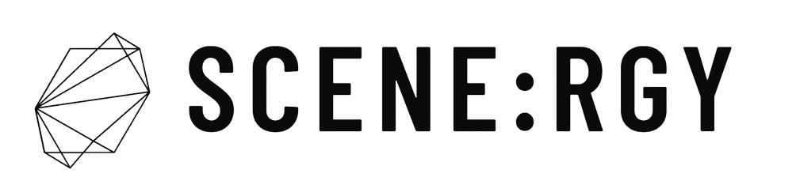

> 음악과 사람을 잇는 모든 연결의 시작, 시너지
---


---
###  💎프로젝트 진행기간
2024.01.08(월) ~ 2024.02.16(금) (40일간 진행)  
SSAFY 10기 2학기 공통 프로젝트 - SCENE:RGY

---
### 🎬소개영상 보기
https://youtu.be/McxwgpA2l3k

--- 
### 🏅 SCENE:RGY - 배경

친구, 커뮤니티 게시글로부터 뮤지션들이 팀 활동을 하기 위해 협업파트너를 구하기 어렵다는 이야기를 전해 들었습니다. 저희는 정확히 어떠한 어려움이 있는지 알기 위해 뮤지션들을 대상으로 설문조사를 진행 하였으며, 파트너를 찾는 과정에서 어려움을 겪는 답변으로 ‘협업 파트너를 찾기 어렵다(43.9%)’, ‘실력 검증이 어렵다(43.9%)’의 비율(복수 응답 가능)이 높았습니다. 또한 원하는 기능으로 ‘음악 창작물을 공유(48.8%)’, ‘나의 활동 이력을 관리(53.7%)’의 답변 비율(복수 응답 가능)이 높았습니다.

위와 같은 뮤지션들의 어려움을 해결하기 위해 저희는 자신의 연주 영상을 기록하며 공유하고, 프로필에서 이력서를 관리할 수 있는 기능을 제공하는 ‘Scenergy’ 웹 서비스를 기획하게 되었습니다. Scenergy에서 다른 사람들의 연주 영상을 손쉽게 접하며, 마음에 드는 영상의 연주자의 포트폴리오를 확인해 검증된 협업 파트너를 보다 쉽게 구할 수 있습니다.

___
### 프로젝트 소개
+ Scenergy는 `Springboot` `React`를 기반으로 만들어진 뮤지션을 위한 웹 큐레이팅 SNS 입니다.


---
### 🔎 SCENE:RGY - 개요

SCENE:RGY - 음악인을 위한 연결 플랫폼

더 효율적인 팀 구성을 통해 음악적 시너지를 만들어보세요.

SCENE:RGY는 음악인들의 활발한 교류와 협업을 통해 시너지를 창출하는 플랫폼입니다. 뮤지션들은 SCENE:RGY를 통해 다음과 같은 어려움을 해결할 수 있습니다.

- 지인에 의존하지 않고 원하는 뮤지션과 간편하게 연결  
- 실력 검증 기능을 통해 신뢰할 수 있는 팀원 확보  
- 작업물 공유 및 포트폴리오 제작  

SCENE:RGY의 주요 기능:

- 팔로우 시스템: 관심 있는 뮤지션을 팔로우하여 작업물을 확인하고 팀 구성 제안  
- 실력 검증: 화상통화 기능을 통한 실시간 실력 확인  
- 작업물 공유: 자신만의 작업물을 공유하고 포트폴리오로 활용  
- 채팅 기능: 팀 구성을 위한 간편한 소통  

**SCENE:RGY와 함께 음악적 꿈을 향한 여정을 시작하세요!**


--- 

### 🚩 프로젝트 목표
- 멤버를 구하는데 어려움을 겪는 뮤지션을 위해 플랫폼을 제공합니다.
- 연주 영상 업로드에 특화된 게시글 작성 기능을 통해 자신을 어필하고 싶은 뮤지션에게 좀 더 나은 환경을 제공합니다.
- 역할을 분담하여 서비스를 코드로  **구현**하고  **배포**합니다.
-   구현하는 과정에서 Front-end와 Back-end가  **협업**하는 과정을 이해합니다.
-   RESTful API를 직접 설계하고 API를 통한 HTTP 통신을 겪으며 협업 능력을 기릅니다.
-   자신이 맡은 부분을 남에게 설명할 수 있는 의사소통 능력을 기릅니다.
-   단순히 구현 후 끝나는 것이 아닌  **코드 리뷰**와  **피드백**을 통해 함께 성장합니다.

---
### 기술스택

#### 개발 환경

 

#### 개발

- ##### BackEnd & Database

      

- ##### FrontEnd
   

#### CI/CD
    

#### 협업 툴
      
---
### 백엔드 디렉토리 구조
 ```sh
domain
  ├─ entityName
  │ ├─ controller
  │ │     ├─ request
  │ │     └─response
  │ ├─ entity
  │ ├─ repository
  │ └─ service
  │      └─ command
  │ 
  ├─ test
  │  ├─domain
  │  └─ serviceTest
  └─ ScenergySpringApplication.java
```

### 프론트 디렉토리 구조
```sh
├─actions
├─apis
│  ├─entity
│  ├─Profile
│  ├─User
│  └─VideoUpload
├─assets
│  └─VideoUpload
├─components
│  ├─Chat
│  ├─commons
│  │  ├─Dialog
│  │  ├─Drawer
│  │  ├─Navbar
│  │  ├─ScenergyList
│  │  └─Search
│  ├─JobPost
│  ├─Portfolio
│  ├─Profile
│  ├─Search
│  ├─User
│  └─VideoUpload
├─contexts
├─hooks
├─pages
├─reducers
├─router
└─store
```

---
## 주요 기능
**1. 로그인 & 로그아웃 (네이버 OAuth)**

- **간편한 네이버 로그인**: 중앙 로그인 버튼을 클릭하여 네이버 계정으로 간편하게 로그인하세요.
- **시너지 서비스 이용**: 로그인 후 다양한 시너지 서비스를 이용할 수 있습니다.

**2. 영상 업로드 및 조회**

- **나의 연주 영상 공유**: 자신만의 연주 영상을 쉽게 업로드하고 공유하세요.
- **팔로우 유저 영상 감상**: 팔로우한 유저들의 연주 영상을 감상하고 소통할 수 있습니다.

**3.편리한 채팅 기능**

- **채팅룸 관리** : 메시지 탭에서 채팅룸 리스트를 확인하고 새로운 채팅룸을 만들 수 있습니다.
- **팔로우 유저 초대** : 팔로우한 유저를 채팅룸에 초대하여 함께 소통하세요.

- **최근 메시지 우선**: 최근 메시지가 있는 채팅룸이 맨 위에 표시되어 편리하게 확인할 수 있습니다.
- **미확인 메시지 표시**: 각 채팅룸에 읽지 않은 메시지가 있는 경우 숫자로 표시됩니다.

**4. 실시간 화상 회의**

- **실력 검증 및 합주**: 실시간 화상 회의를 통해 실력 검증 및 합주를 간편하게 진행하세요.

**5. 빠르고 정확한 검색 기능**

- **지역, 장르, 악기별 검색**: 지역, 장르, 악기 태그를 이용하여 원하는 영상을 빠르게 검색하세요.
- **검색어 입력 검색**: 키워드를 입력하여 원하는 영상을 간편하게 찾아보세요.

**6. 알림 기능**

- 팔로우 및 채팅 알림: 팔로우, 채팅 관련 알림을 통해 중요한 정보를 놓치지 마세요.

**7. 프로필 관리 및 조회**

- **프로필 관리**: 나의 프로필 정보를 편리하게 관리하고 갱신할 수 있습니다.
- **영상 및 포트폴리오 관리**: 나의 대표 영상, 영상 목록, 포트폴리오를 한눈에 확인하고 관리하세요.


---

### 프로젝트 산출물

- [페르소나](docs/프로젝트%20산출물/페르소나.md)
- [기능명세서](docs/프로젝트%20산출물/기능명세서.md)
- [시스템 아키텍처](docs/프로젝트%20산출물/시스템아키텍처.md)
- [와이어프레임](docs/프로젝트%20산출물/와이어프레임.md)
- [화면정의서](docs/프로젝트%20산출물/화면정의서.md)
- [ERD](docs/프로젝트%20산출물/ERD.md)
- [Flow chart](docs/프로젝트%20산출물/FlowChart.md)
- [시퀀스 다이어그램](docs/프로젝트%20산출물/시퀀스다이어그램.md)
- [API 명세서](docs/프로젝트%20산출물/API명세서.md)
- [BE 코드 컨벤션](docs/프로젝트%20산출물/BE코드컨벤션.md)
- [FE 코드 컨벤션](docs/프로젝트%20산출물/FE코드컨벤션.md)
---
### 프로젝트 결과물

- [중간 발표자료](docs/프로젝트%20결과물/기획발표자료.md)
- [최종 발표자료](docs/프로젝트%20결과물/최종발표자료.md)

---

### 팀원 소개
### Contributors

<table style="width: 100%; text-align: center;">
  <tr>
    <td style="text-align: center;"><br><strong>김준표</strong><br>🍪Back-end<br>💎Team Leader<br>🤴Back-end Leader</td>
    <td style="text-align: center;"><br><strong>김혜지</strong><br>💟Back-end</td>
    <td style="text-align: center;"><br><strong>이민형</strong><br>🧗‍♂️Back-end<br>🧔Survey Leader</td>
  </tr>
  <tr>
    <td style="text-align: center;"><br><strong>이태경</strong><br>🍖Back-end<br>🎥발표/UCC 제작</td>
    <td style="text-align: center;"><br><strong>김은지</strong><br>🌹Front-end<br>👸Front-end Leader</td>
    <td style="text-align: center;"><br><strong>강대은</strong><br>🍞Front-end</td>
  </tr>
</table>

---
## SCENE:RGY 서비스 화면

### 로그인


### 화상채팅


### 검색


### 알림


### 영상 업로드


### 채팅


### 프로필


### 피드


### 구인구직
