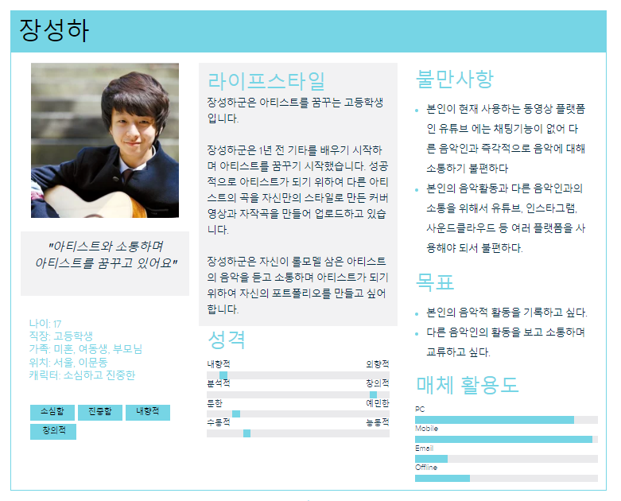
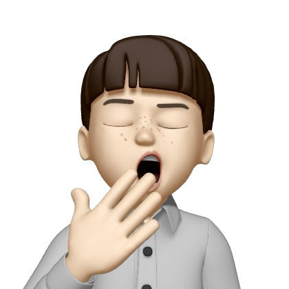
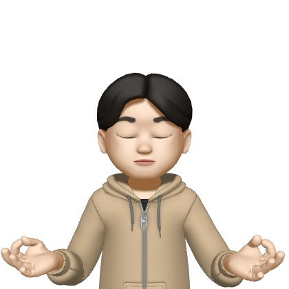
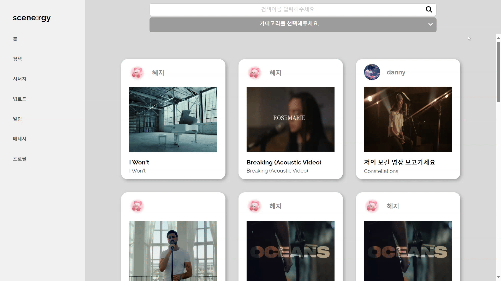
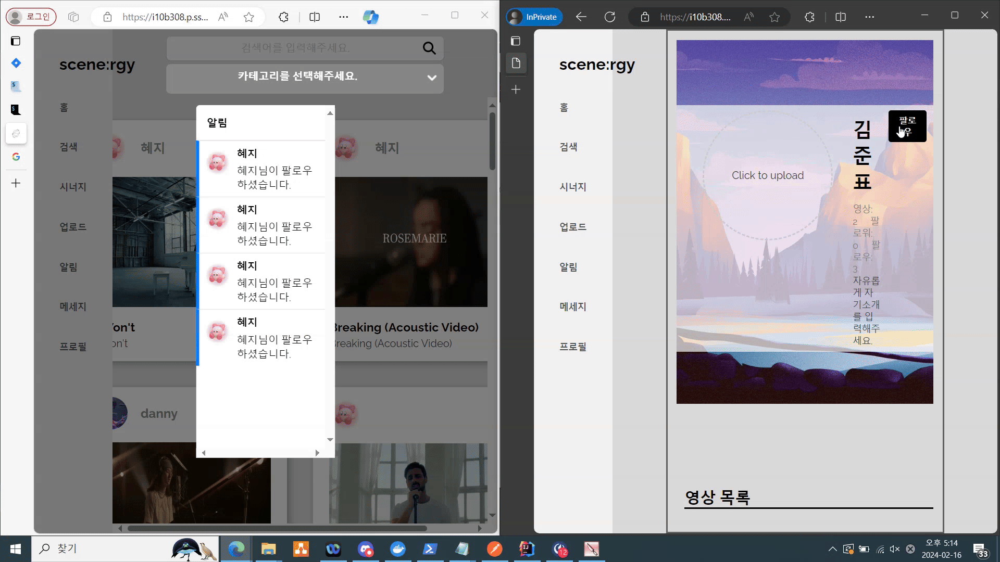
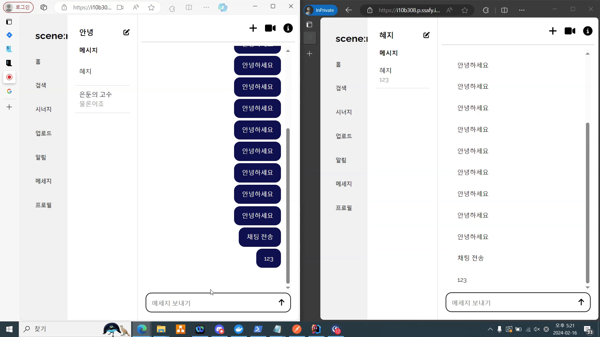
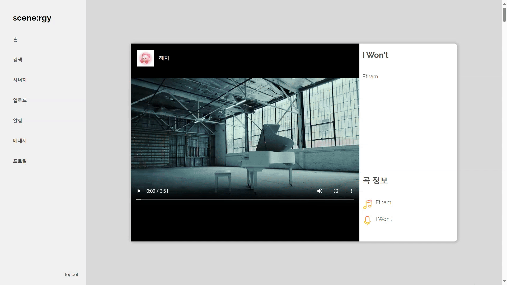

> 음악과 사람을 잇는 모든 연결의 시작, 시너지
---


---
###  💎프로젝트 진행기간
2024.01.08(월) ~ 2024.02.16(금) (40일간 진행)  
SSAFY 10기 2학기 공통 프로젝트 - SCENE:RGY

---
### 🎬소개영상 보기
https://youtu.be/McxwgpA2l3k

--- 
### 🏅 SCENE:RGY - 배경

현재 뮤지션들이 함께할 팀원을 찾기 위해 할 수 있는 방법은 많이 한정되어있습니다.

주변인들에게 수소문해서 팀원을 찾거나, 실력검증을 할 수 없는 경우가 대부분입니다.

이러한 상황에 지치신 뮤지션이라면 SCENE:RGY와 함께 이러한
고민을 해결해보세요!

---
### 🔎 SCENE:RGY - 개요

-보다 효율적인 팀매칭으로-

SCENE:RGY 는 음악인들의 SCENE을 활성화하여 더욱 큰
시너지를 낼 수 있도록 하는 목표를 가지고 출발한 서비스입니다.

현재 뮤지션들이 팀원을 구하기 위해서는 대부분 지인들의 도움을
받아야하고, 실력검증을 하기도 어려운 상황입니다.

SCENE:RGY 서비스를 사용하면, 원하는 뮤지션과 더 쉽고 빠르게
컨택할 수 있습니다.

원하는 뮤지션을 팔로우하면 그 뮤지션의 작업물을 피드에서 확인할 수 있습니다.
팔로워가 생기면 알림을 받아볼 수 있습니다.

자신의 작업 내용을 공유하고, 포트폴리오로써 사용 할 수 있으며 팀을 꾸리고 싶은
뮤지션이 있다면 채팅을 보내 직접 컨택할 수 있습니다.
채팅을 보낸 후, 화상통화를 통해 빠르게 실력을 검증할 수 있습니다.

--- 
### 기술스택

#### 개발 환경

    

#### 개발
    

#### 커뮤니케이션
 
---
### 기능정의서 및 ERD

#### 기능정의서
##### 🔗[기능정의서](https://docs.google.com/spreadsheets/d/1eb2wqtTxqo4EBiJq_kRAA-wO56QQbC8ycn4FkqmRq-s/edit#gid=2139742202)
#### ERD

---
### 페르소나
#### 1️⃣ 드러머 구하는 김민석


#### 2️⃣ 버스킹 팀을 구하는 김미솔


#### 3️⃣ 아티스트를 꿈꾸는 장성하
{: width="600"}

### 시스템 아키텍처


---
### 백엔드 디렉토리 구조
 ```sh
domain
  ├─ entityName
  │ ├─ controller
  │ │     ├─ request
  │ │     └─response
  │ ├─ entity
  │ ├─ repository
  │ └─ service
  │      └─ command
  │ 
  ├─ test
  │  ├─domain
  │  └─ serviceTest
  └─ ScenergySpringApplication.java
```

### 프론트 디렉토리 구조
```sh
├─actions
├─apis
│  ├─entity
│  ├─Profile
│  ├─User
│  └─VideoUpload
├─assets
│  └─VideoUpload
├─components
│  ├─Chat
│  ├─commons
│  │  ├─Dialog
│  │  ├─Drawer
│  │  ├─Navbar
│  │  ├─ScenergyList
│  │  └─Search
│  ├─JobPost
│  ├─Portfolio
│  ├─Profile
│  ├─Search
│  ├─User
│  └─VideoUpload
├─contexts
├─hooks
├─pages
├─reducers
├─router
└─store
```
---
## 주요 기능
**로그인 & 로그아웃 (네이버 OAuth)**
- 중앙의 로그인 버튼을 누른 후 소셜 로그인을 진행할 수 있습니다
- 로그인 한 사용자는 시너지 서비스를 이용할 수 있습니다.

**영상 업로드**
- 자신의 연주 영상을 업로드 할 수 있습니다.
- 팔로우 한 유저의 영상을 조회할 수 있습니다.
 
**채팅**
- 메시지 탭에 들어가면 자신이 참여한 채팅룸 리스트와 채팅룸 만들기가 있습니다.
- 본인이 팔로잉 하고 있는 유저를 초대해 채팅룸을 만들 수 있습니다.
- 채팅룸 리스트는 최근 메시지 순으로 정렬되어 있습니다.
- 각각의 메시지를 읽지 않은 맴버의 수를 표시합니다.

**화상 회의**
- 화상회의를 통해 빠른 실력검증 및 합주가 가능합니다.

**검색**
- 지역, 장르, 악기태그로 영상을 검색 할 수 있습니다.
- 검색어 입력을 통해 원하는 영상을 검색 할 수 있습니다.

**알림**
- 팔로우와 채팅 알림을 받을 수 있습니다.

**프로필 조회**
- 자신의 프로필을 조회하고, 정보를 갱신할 수 있습니다.
- 프로필에서 자신의 대표영상과 영상 목록을 조회할 수 있습니다.
- 자신의 포트폴리오를 작성하고 조회할 수 있습니다.
---

### 프로젝트 산출물

- [페르소나](docs/프로젝트%20산출물/페르소나.md)
- [기능명세서](docs/프로젝트%20산출물/기능명세서.md)
- [시스템 아키텍처](docs/프로젝트%20산출물/시스템아키텍처.md)
- [와이어프레임](docs/프로젝트%20산출물/와이어프레임.md)
- [화면정의서](docs/프로젝트%20산출물/화면정의서.md)
- [ERD](docs/프로젝트%20산출물/ERD.md)
- [Flow chat](docs/프로젝트%20산출물/FlowChat.md)
- [시퀀스 다이어그램](docs/프로젝트%20산출물/시퀀스다이어그램.md)
- [API 명세서](docs/프로젝트%20산출물/API명세서.md)
- [BE 코드 컨벤션](docs/프로젝트%20산출물/BE코드컨벤션.md)
- [FE 코드 컨벤션](docs/프로젝트%20산출물/FE코드컨벤션.md)
---
### 프로젝트 결과물

- [중간 발표자료](docs/프로젝트%20결과물/기획발표자료.md)
- [최종 발표자료](docs/프로젝트%20결과물/최종발표자료.md)

---

### 팀원 소개
### Contributors

<table style="width: 100%; text-align: center;">
  <tr>
    <td style="text-align: center;"><br><strong>김준표</strong><br>🍪Back-end<br>💎Team Leader<br>🤴Back-end Leader</td>
    <td style="text-align: center;"><br><strong>김혜지</strong><br>💟Back-end</td>
    <td style="text-align: center;"><br><strong>이민형</strong><br>🧗‍♂️Back-end<br>🧔Survey Leader</td>
  </tr>
  <tr>
    <td style="text-align: center;"><br><strong>이태경</strong><br>🍖Back-end<br>🎥발표/UCC 제작</td>
    <td style="text-align: center;"><br><strong>김은지</strong><br>🌹Front-end<br>👸Front-end Leader</td>
    <td style="text-align: center;"><br><strong>강대은</strong><br>🍞Front-end</td>
  </tr>
</table>

---
## SCENE:RGY 서비스 화면
### 화상채팅


### 검색


### 알림


### 영상 업로드


### 채팅


### 프로필


### 피드
